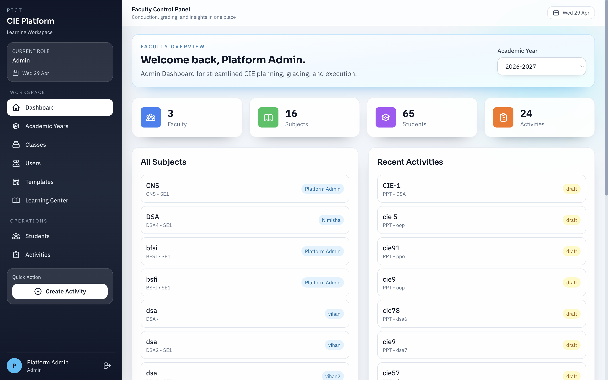
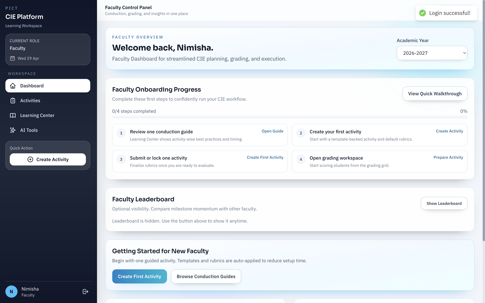
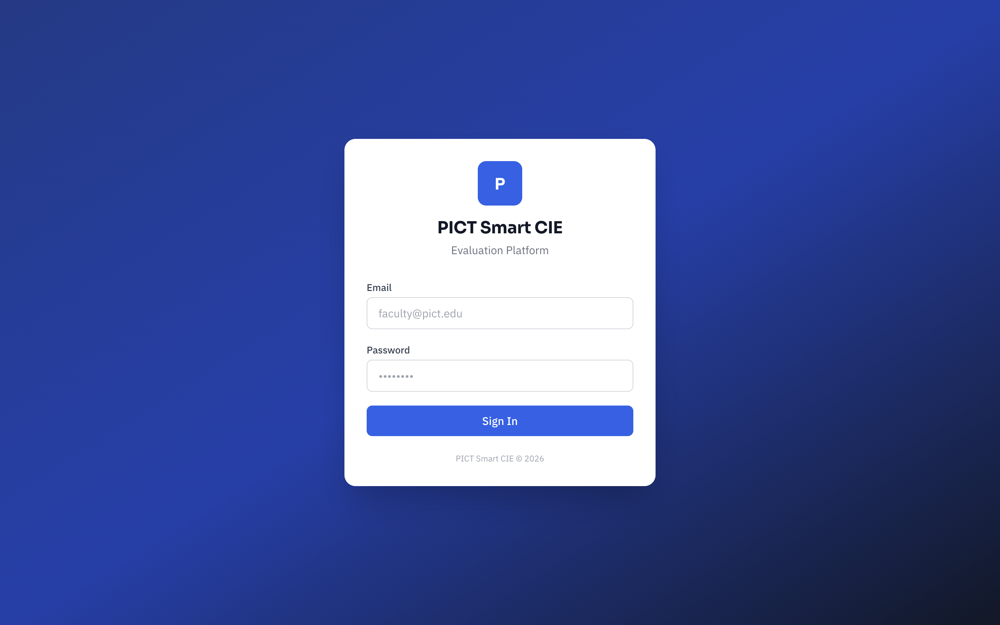
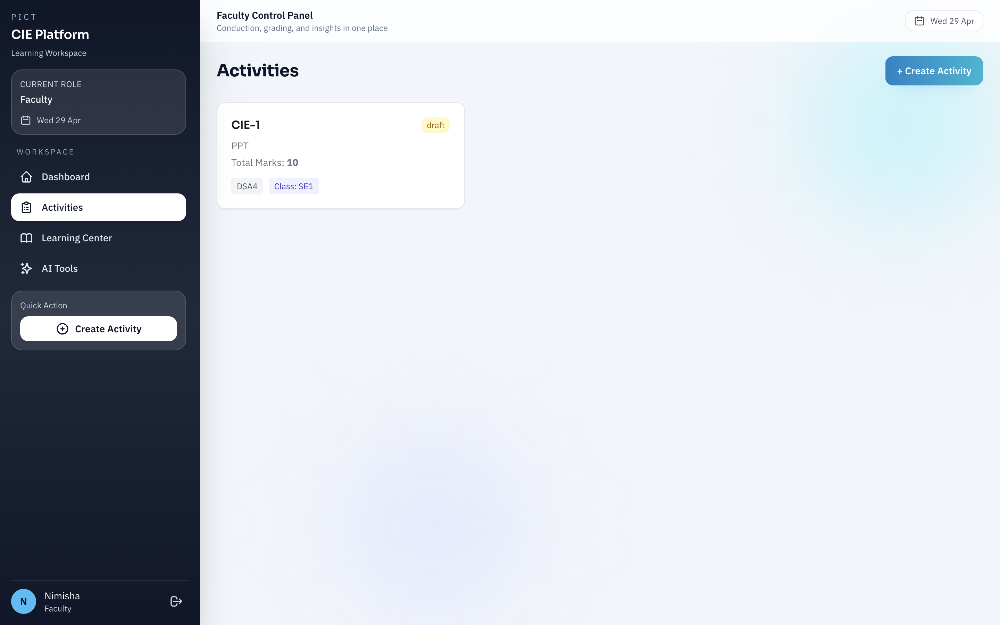
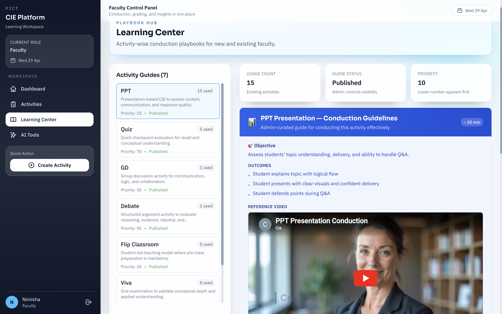

# PICT Smart CIE Evaluation Platform

A production-ready MERN stack web application for managing **Continuous Internal Evaluation (CIE)** using rubric-based grading in engineering colleges.

## 🚀 Features

- **Role-Based Access** — Admin & Faculty roles with JWT authentication
- **Academic Structure** — Manage Academic Years → Classes → Students
- **Rubric-Based Grading** — Create activities with professional 5-point scale rubrics (auto-generated per activity type)
- **AG Grid Grading** — Interactive spreadsheet-style grading interface with CSV export
- **Auto Scoring** — Automatic score calculation and final result computation
- **Excel Import/Export** — Bulk student import (Admin only) and results export
- **PDF Reports** — Generate formatted PDF reports with PDFKit
- **AI-Powered Tools** — Rubric generation, guideline suggestions, student feedback, class insights, and NAAC/NBA report generation (Google Gemini)
- **Activity Templates** — Reusable templates with default rubrics
- **Conduction Guidelines** — Built-in faculty guidelines for each activity type (PPT, Viva, GD, Lab, etc.)
- **Docker Deployment** — Full Docker Compose setup with MongoDB, Node.js Backend, and Nginx-served React Frontend

## 📸 Screenshots

These screenshots show the main flows in the app:

### Admin Login



### Faculty Login



### Login Page



### Activities



### Learning Center



## 🌐 Production Hosting

The frontend is hosted on Vercel and the backend API is hosted on Render.

For VPS/cloud deployment using the `testing` branch, see **`HOSTING.md`**.

It includes:
- Production compose usage (`docker-compose.prod.yml`)
- Required environment hardening
- Health checks and first-time seeding
- HTTPS guidance and update workflow

---

## 🛠️ Quick Start (Docker — Recommended)

### Prerequisites

- **Docker Desktop** installed and running ([Download](https://www.docker.com/products/docker-desktop/))
- **Git**

```

### 6. Open the app

- **App URL:** https://cie-platform-alpha.vercel.app

That's it! The platform is running with:
- **MongoDB** on port 27017
- **Backend API** on port 5000
- **Frontend** on port 80 (via Nginx)

---

## 📋 First-Time Setup (After Login)

1. **Create Academic Years** — e.g., "Second Year", "Third Year"
2. **Create Classes** — e.g., "SE 1", "TE 1" (under their academic year)
3. **Create Faculty Users** — From the Users page (Admin only)
4. **Import Students** — Upload Excel files with "Roll No" and "Name" columns (Admin only)
5. **Faculty Login** — Faculty can create activities, grade students, and use AI tools

---

## 🔧 Local Development (Without Docker)

### Prerequisites
- Node.js 20+
- MongoDB 7+ running locally
- npm

### Steps

```bash
# Backend
cd backend
cp .env.example .env
# Edit .env: change MONGO_URI to mongodb://localhost:27017/pict_cie
npm install
node utils/seed.js
npm run dev

# Frontend (new terminal)
cd frontend
npm install
npm run dev
```

Open http://localhost:5173

---

---

## 🤖 AI Configuration

AI features (rubric generation, guidelines, insights, NAAC reports) require a **Google Gemini API key**.

1. Get a free key at https://aistudio.google.com/apikey
2. Edit `backend/.env`:
   ```env
   AI_PROVIDER=gemini
   GEMINI_API_KEY=your-gemini-api-key-here
   GEMINI_MODEL=gemini-2.0-flash
   ```
3. Rebuild: `docker compose build --no-cache backend && docker compose up -d`

---

## 🏗️ Project Structure

```
pict-cie-platform/
├── docker-compose.yml          # Docker orchestration
├── nginx/default.conf          # Nginx reverse proxy config
├── backend/
│   ├── .env.example            # Environment template
│   ├── Dockerfile
│   ├── server.js               # Express entry point
│   ├── config/                 # env.js, db.js, defaultRubrics.js
│   ├── models/                 # 15 Mongoose models
│   ├── middleware/             # auth, roleCheck, rateLimiter, upload, validate
│   ├── controllers/            # 11 controllers
│   ├── routes/                 # 11 route files
│   ├── services/               # aiService, scoringEngine, excelService, pdfService
│   └── utils/                  # seed.js, helpers.js
└── frontend/
    ├── Dockerfile
    ├── nginx.conf              # SPA routing config
    ├── vite.config.js
    └── src/
        ├── api/axios.js         # API client
        ├── context/AuthContext.jsx
        ├── layouts/MainLayout.jsx
        ├── components/          # Modal, RubricEditor, ConductionGuidelines
        └── pages/              # 12 pages
```

---

## 📝 API Endpoints

| Group          | Base Path              | Auth        |
|----------------|------------------------|-------------|
| Auth           | `/api/auth`            | Public/JWT  |
| Academic Years | `/api/academic-years`  | JWT         |
| Classes        | `/api/classes`         | JWT         |
| Students       | `/api/students`        | JWT (Admin write) |
| Activities     | `/api/activities`      | JWT         |
| Rubrics        | `/api/rubrics`         | JWT         |
| Scores         | `/api/scores`          | JWT         |
| Exports        | `/api/exports`         | JWT         |
| AI             | `/api/ai`              | JWT         |
| Admin          | `/api/admin`           | Admin only  |

---

## 🛑 Stopping & Cleanup

```bash
# Stop all containers
docker compose down

# Stop and remove all data (fresh start)
docker compose down -v
```

## 📄 License

MIT
